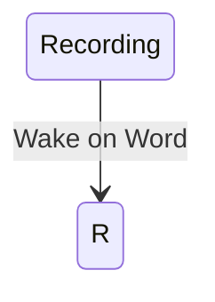

# An on-device approach to Skill Based Voice Assistants 

## Abstract

## Introduction 
In the wake of current improvements in Large Language Models and the increased commercialisation of open source technologies, the market centralises most of its developments in the private sector. Most of the advances come at the cost of user privacy and the data that the user produces. Monetization of such models is hard, as they consume a lot of energy and they're not sustainable to be run at current scale. The only reason companies can do so is the investments possible in such a bubble. 
Tech bubbles aren't something new, but it's clear that the way forward for the field is to keep everything local so that you don't leak any important information. 
This paper proposes leveraging the power of the contextual understanding of Language Models for identifying commands in natural language. 

### Scope of the project
Schematically, it would look something like this: 

The main advantage of this approach is the flexibility it gives to the user and the openness of the ecosystem. By defining modules, users can contribute by adding custom addons and improving the performance. 

More so, most of the software is efficient enough to run on an power sipping single board computer by utilising tflite and the ONNX runtime.

## Where 
